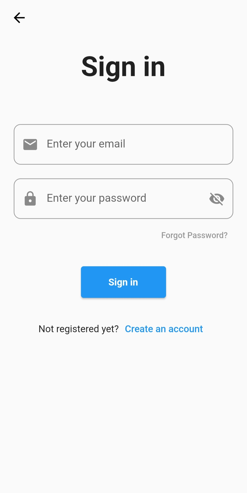

# Recognition App

## About the project

A Flutter code base for time series data collection. 

Connected to a Firebase project, the application allows users to generate time series of the acceloremeter and gyroscope's sensor values during a selected time frame before labeling the activity. The purpose of the application is to feed a training database for activity recognition with time series classification. 

A longer report explaining all the purposes and details of the global project is [available here](https://drive.google.com/file/d/1y3xJJJHLggMplfP0fw0EnrUiZ2SLLEJa/view) (in french).

### Built with

Mobile app built with Flutter. Our database and account functionnality are made thanks to Firebase.

[![Flutter][Flutter]][Flutter-url]

[![Firebase][Firebase]][Firebase-url]

## Getting started

### Prerequesites

* Flutter : Install flutter following the [official documentation](https://docs.flutter.dev/get-started/install)
* If you use VS Code : install the flutter extension
* If you use Android Studio : Open plugin preferences (File > Settings > Plugins). Select Marketplace, select the Flutter plugin and click Install.
* Enable USB debugging on your device, if you're using android you can do the following :
    1. Open the Settings app.
    2. Select System.
    3. Scroll to the bottom and select About phone.
    4. Scroll to the bottom and tap Build number 7 times.
    5. Return to the previous screen to find Developer options near the bottom.
    6. Scroll down and enable USB debugging.


### Installation

1. Clone the repository
```sh
git clone https://github.com/HugoLAMOUREUX/RecognitionApp
```

2. Install the dependencies :

```sh
flutter pub get
```

3. Connect your phone (USB debugging need to be enabled, see prerequesites)

4. Install the app and use it on your phone:
```sh
flutter run
```

## Usage

In the beginning, you can register or log in :
<br/>
<br/>
 
 
 

Once connected, you can record an activity, see the previous activities saved and download the data :
<br/>
<br/>
 
 

If you click on start an activity, you'll start to record an activity. You'll then be able to remove some points at the beginning and the end of the time serie and give a label to the activity recorded :
<br/>
<br/>
 
 
 
 


## License

Distributed under the MIT License. See [LICENSE.txt](https://github.com/HugoLAMOUREUX/RecognitionApp/blob/main/LICENSE.txt) for more information.

## Contact

Hugo LAMOUREUX - hugo.lamoureux18@gmail.com - [Linkedin](https://www.linkedin.com/in/hugo-lamoureux-4130211a4/)

Selim GMATI - gmatis3lim@gmail.com - [Linkedin](https://www.linkedin.com/in/selim-gmati-06a07614a/)

Project Link: [https://github.com/HugoLAMOUREUX/RecognitionApp](https://github.com/HugoLAMOUREUX/RecognitionApp)


[Flutter]: https://img.shields.io/badge/Flutter-20232A?style=for-the-badge&logo=flutter&logoColor=61DAFB
[Flutter-url]: https://flutter.dev/
[Firebase]: https://img.shields.io/badge/Firebase-20232A?style=for-the-badge&logo=Firebase&logoColor=#80e329
[Firebase-url]: https://firebase.google.com/
